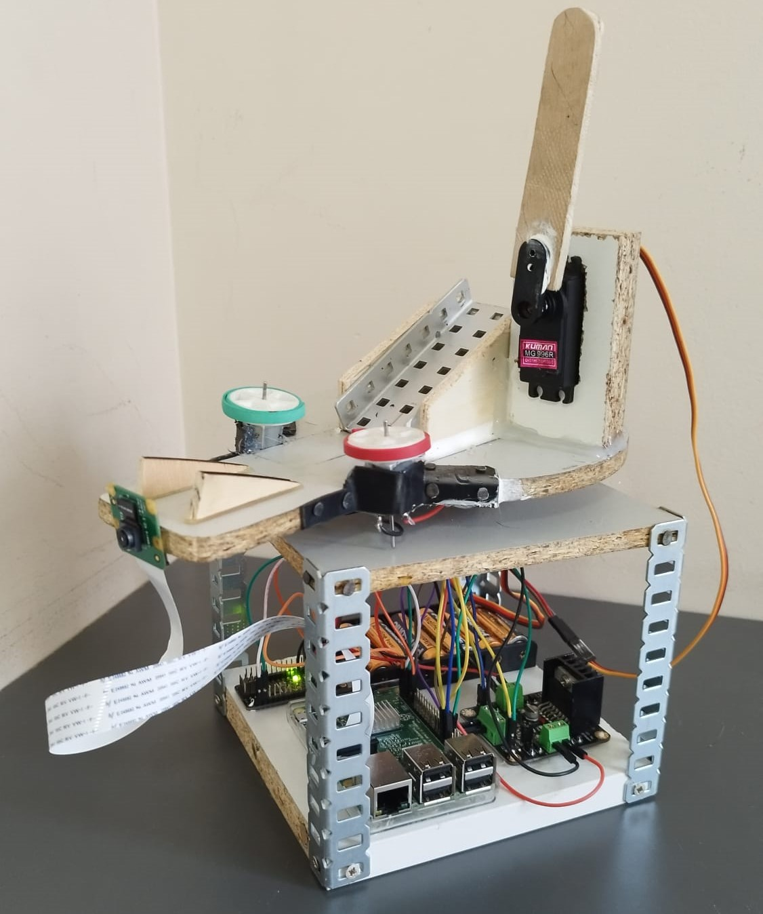
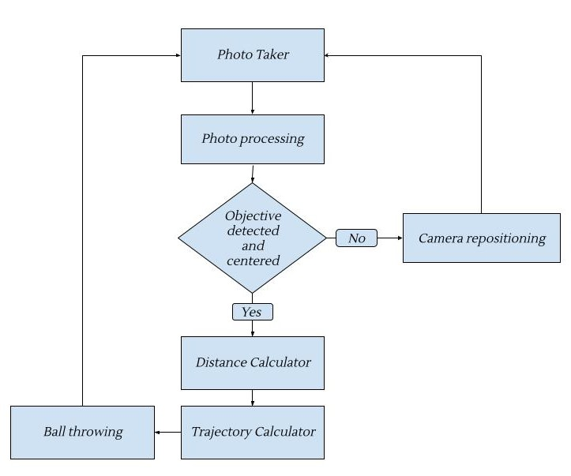
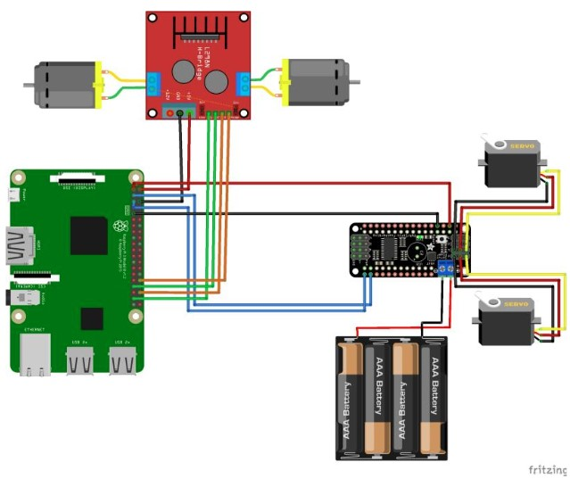

# Basket-Bot
# Table of Contents
* [Description](#description)
* [Requirements](#requirements)
    * [Software](#software)
    * [Hardware](#hardware)
* [How to use](#how-to-use)
* [Youtube link](#youtube-link)
* [Authors](#authors)
* [References](#references)

# Description
This robot will consist of a rotating base with a camera, a barrier that can be raised and lowered with a servo, and two wheels attached to motors that will move at the desired speed.

When the robot is turned on, all the electronic components will be set to their initial positions and a barrier will be placed for the ball, which we will place on the initial downward ramp, to keep it in an initial position. Simultaneously, the robot will start rotating and taking photos with the camera. Using computer vision, we will be able to process and identify the target, estimating the actual distance to the point where we should shoot the ball.

Once the target is centered, the necessary calculations will be made to determine the speed at which the motors should move, so that when the barrier is unlocked, the ball will be launched towards an upward slope, following a trajectory that will make it score into the target. The position of the target can be changed within a certain range so the robot must be able to detect it and still score the ball.

# Requirements
## Software
- [Python 3.10.x or greater](https://www.python.org/)
- [gpiozero](https://pypi.org/project/gpiozero/)
- [opencv-python](https://pypi.org/project/opencv-python/)
- [numpy](https://pypi.org/project/numpy/)
- [adafruit-circuitpython-motor](https://pypi.org/project/adafruit-circuitpython-motor/)

The software architecture of our python program is as follows:



Each software module can be described as:
- **Photo Taker**: This module will capture the current image of the robot through the camera connected to the Raspberry Pi.
- **Photo processing**: This module will process the current image of the robot to detect the target where the ball should be shot.
- **Objective centered**: This module will detect if our basket is in the center of the target.
- **Camera repositioning**: If the target is not found or not centered, the camera will rotate to try to center the object or be able to detect it. From here, we will return to the initial Photo Taker module.
- **Distance calculator**: This module will be executed if the target is detected and the camera is centered on it. It will calculate the actual distance from the camera to the target.
- **Trajectory calculator**: With this module, we will calculate the motor speed so that when we release the barrier, the ball follows the necessary trajectory to score in our target.
- **Ball throwing**: With this module, we will open the barrier and set the motors to the appropriate speed for the ball to be launched towards the basket. Once we reach this point, we will start again from the Image Extractor module.

## Hardware
- Raspberry PI 3 B
- Camera Module for Raspberry Pi
- 2 Servos
- 2 Electric Motors
- Servo Controller
- Electric Motor Controller
- Power Supply for Raspberry Pi
- Battery Holder

The hardware architecture of our robot is as follows:



For the use of these components, we have connected the two controllers to the Raspberry Pi. Firstly, we have connected the servo controller using the I2C pins, SDA and SCL. Additionally, we have provided power to these pins using the 3.3V pin and the ground pin, along with a 9V battery.

On the other hand, for the motor controller, we have powered it using the 5V pin and the ground pin. To control the motor speed, the input pin of the controller is connected to a PWM-enabled pin (12 or 13), and the control pin of the controller is connected to any other pin that can send a signal.

# How to use
1. Clone this repository
2. Install python 3.10.x or greater if required
3. Install required libraries with the help of this command:
```
pip install -r requirements.txt
```
4. Run python program "basketbot.py"

# Youtube Link
https://youtu.be/8wZxZwybr60

# Authors
- Oriol Camps Isus
- Martí Bruix Fernández
- Gabriel Chirinos Sulcany
- Iván Peñarando Martínez

# References
This project has been inspired by the following Internet concepts:

- https://wiki.purduesigbots.com/hardware/shooting-mechanisms/flywheel
- https://www.youtube.com/watch?v=l7MSg4jLTRk
